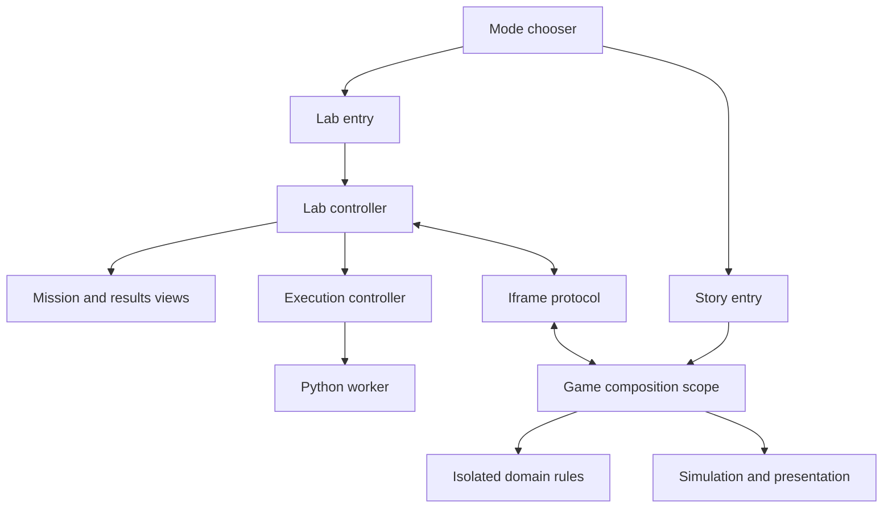

# BITBOUND architecture — v27

This is the current maintenance guide. Earlier implementation notes are retained
in `docs/history/architecture-through-v26.md`. Start with `CONTRIBUTING.md` for
commands and the change-location table.

## Runtime ownership

BITBOUND is a static site with two entry paths. The chooser loads neither the
editor nor the Story simulation. The Lab loads CPython in a worker. Story creates
one Lab iframe when a coding challenge needs it, then reuses it.

“Iframe protocol” here means named message kinds and runtime identity/
correlation checks, not a TypeScript compiler guarantee.

## Modules and responsibilities

| Area | Owner | Boundary |
| --- | --- | --- |
| Balance and equipment | `adventure/domain/game-config.js` | Data only; no live state or DOM |
| Fresh session/player data | `adventure/domain/campaign-state.js` | New nested arrays/maps per call |
| Trail learning order | `adventure/domain/learning-path.js` | Explicit world/stage/progress inputs; deterministic results |
| Plot schema/migration | `adventure/domain/plot-state.js` | Serialized flags and scene IDs; no presentation |
| Story save validation | `adventure/domain/story-save.js` | Detached candidate plus injected catalogs/validators |
| Iframe vocabulary | `shared/protocol.js` | Message kinds and exact sender/origin checks |
| Story adapters | `adventure/systems/` | Bind UI, world state, renderers, audio and domain rules |
| Lab composition | `app/lab/controller.js` | Selection, mode events and manual session coordination |
| Lab catalog | `app/lab/catalog.js` | One-pass chapter indexes and O(1) task lookup |
| File commands | `app/lab/files.js` | Current workspace only; rejects an import after selection changes |
| Run lifecycle | `app/lab/execution.js`, `app/runner.js` | One active run, bounded output and awaited cancellation |
| Lab presentation | `app/lab/mission-view.js`, `results-view.js` | Render data and trace state; no worker construction |
| Python evaluation | `app/python-worker.js`, `app/grader.py` | CPython and task checks off the UI thread |
| Manual file format | `app/session-file.js`, `session-controls.js` | Validate before replacement; download only on explicit save |
| App caching | `app/offline.js`, `offline-session.js`, worker template | Verified app bytes, independent of student progress |

The game still uses one private shared simulation context: `state`, `player`,
spatial indexes, caches, pools and the ordered systems. Rendering/combat adapters
operate on that context without cloning it every frame. The six reusable domains
have isolated scopes and explicit APIs; they are not additional window globals.
Do not put new reusable business rules back into the rendering/composition scope.

## Data sources

- `app/curriculum.json`: the 48 coding tasks, tests, examples and solutions.
- `adventure/encounter-questions.json`: all 268 ordered, world-specific trail lessons.
- `adventure/tutorials.json`: BYTE's concept lessons/checks.
- `adventure/story.json`: authored narrative and scene descriptions.
- `adventure/domain/game-config.js`: equipment, pets, tiles and mobility values.
- `adventure/systems/order.json`: explicit registration and initialization order.
- `scripts/build-config.json`: domain namespaces, engine/editor inputs, native
  module roots, entry pages and the offline asset allowlist/folders.

Curriculum generation rejects mismatched chapter counts, tutorial IDs and answer
indices. Learning-model tests compare partial-progress behavior across all worlds
and stages. Existing gameplay tests prove every lesson is required, including
without random carriers, and that bosses cannot trigger question encounters.

## Save and message contracts

Student work is session-local. Fresh visits ignore earlier students' browser data.
Manual saves retain format `bitbound-student-session`, version 1. Story snapshots
retain version 1 and encounter migration version 4; accepted earlier saves still
pass through the same migrations and sanitization.

| Message group | Direction | Correlation |
| --- | --- | --- |
| Open/hide a challenge | Story → Lab | Task ID and practice session |
| Challenge completed | Lab → Story | Must match current task AND practice session |
| Snapshot/load/reply | Both | Request ID, finite timeout and revision |
| Session changed/saved | Both | Non-negative revision; mark only the saved revision |
| Workspace/Python readiness | Lab → Story | Exact child window and same origin |

A message must come from the intended parent/iframe, not just another same-origin
page. The worker separately uses increasing request IDs and worker identity to
reject old replies. `stopAndWait()` waits for execution cleanup before a new file
session replaces state. Python file imports similarly verify that the target
workspace did not change while reading the file.

Only the existing music preference is kept in sessionStorage, under
`bitbound-music`. It contains no names, code, answers or checkpoints. Offline
Cache Storage holds application files, not student progress.

## Runtime cost

The accepted performance mechanisms remain in place:

- Fixed 60 Hz simulation, bounded catch-up and adaptive rendering profiles.
- One-dimensional spatial hashing for local enemy queries; bounded entity counts.
- Pooled particles, compacted arrays and bounded terrain/sprite caches.
- Paused/hidden rendering loops do not schedule continuing simulation work.
- CPython runs in a separate worker with cancellation and output limits.
- Learning catalogs are indexed once. Progress reads scan only one short world
  path without allocating a filtered array; task lookup uses a Map.

## Build and delivery

`scripts/build.py` coordinates stages; importing its helpers has no write effects.

1. `buildlib/bundles.py` combines the registered domains/systems and pinned editor.
   Each game domain is a native module with declarations and one final named
   export list; compilation creates a private closure with that public API.
2. `buildlib/curriculum.py` adapts the authored JSON through
   `scripts/questions-template.js` without editing the authored data.
3. `buildlib/revisions.py` walks all nested static native imports, rejects cycles,
   versions dependencies transitively and updates entry HTML references.
4. `buildlib/offline.py` fingerprints paths and final bytes, then emits the
   manifest and matching worker. File writes explicitly use UTF-8/LF and atomic
   replacement per file. A multi-file build is not itself a deployment transaction.
5. `check_build.py` rebuilds in a disposable copy and checks both source/output
   agreement and second-build byte identity. The working tree is not modified.
6. `package_release.py` creates a reproducible archive and verifies the offline
   assets inside it, including the nested Python standard-library ZIP.

There are no new runtime dependencies or development package downloads. Node is
used for tests; Python's standard library owns build and release tasks. The
vendored Python/editor runtime and license files remain pinned.

## Validation and change policy

`npm run check` runs architecture checks, reproducibility checks and the registered
47 test processes. Coverage includes the 48 Python solutions/180 grading cases,
all 268 trail lessons, all 81 story pages, animation continuity, audio, touch,
manual saves, iframe isolation, worker cancellation and offline recovery.

`tests/fixtures/accepted-content.json` protects the approved narrative, questions,
logos, HTML structure and CSS against accidental changes during refactors. HTML
comparison ignores generated revision strings only. Procedural animation code
is covered by the existing dense frame/behavior tests.

The checker deliberately supports the project's static relative-import grammar;
it is not a general-purpose parser or type checker. Domains, registration, module
cycles, runtime assets and storage ownership are checked explicitly. Introduce a
new dependency pattern through a reviewed build/design change, not a bypass.

The GitHub quality workflow checks Windows and Linux. Local headless tests cannot
prove physical mobile layout, browser frame rate, temperature or actual audio.
See `V27_VALIDATION.md` for exactly what was tested for this release.

## Handheld presentation (v28)

`adventure/handheld.js` owns browser capability detection, gesture-triggered
fullscreen/orientation requests, the portrait fallback and listener cleanup.
It receives platform objects and a pause callback; it owns no game or save state.
Requests are invalidated when coding opens or the page leaves, so a delayed
browser promise cannot lock an editor. There is no orientation polling.

`adventure/touch-controls.js` owns a captured D-pad pointer and independent action
pointers. `systems/22-touch.js` connects them to existing gameplay actions. Held
attacks run through the existing simulation/cooldown, without a new timer loop.
The downward D-pad direction shares the keyboard fast-fall behavior.

`orientationPaused` is an independent pause owner in `05-progress.js`. Clearing it
cannot close an existing lesson/story overlay. Opening Python questions releases
the orientation lock; the keyboard never triggers the rotate prompt while editing.

`adventure/handheld.css` owns console rails, the 16:9 playfield and safe areas.
The canvas resolution/physics are unchanged. Story dialogs sit outside the game
viewport, so they retain the whole display. Touchscreen laptops with a primary
mouse retain the desktop presentation.
